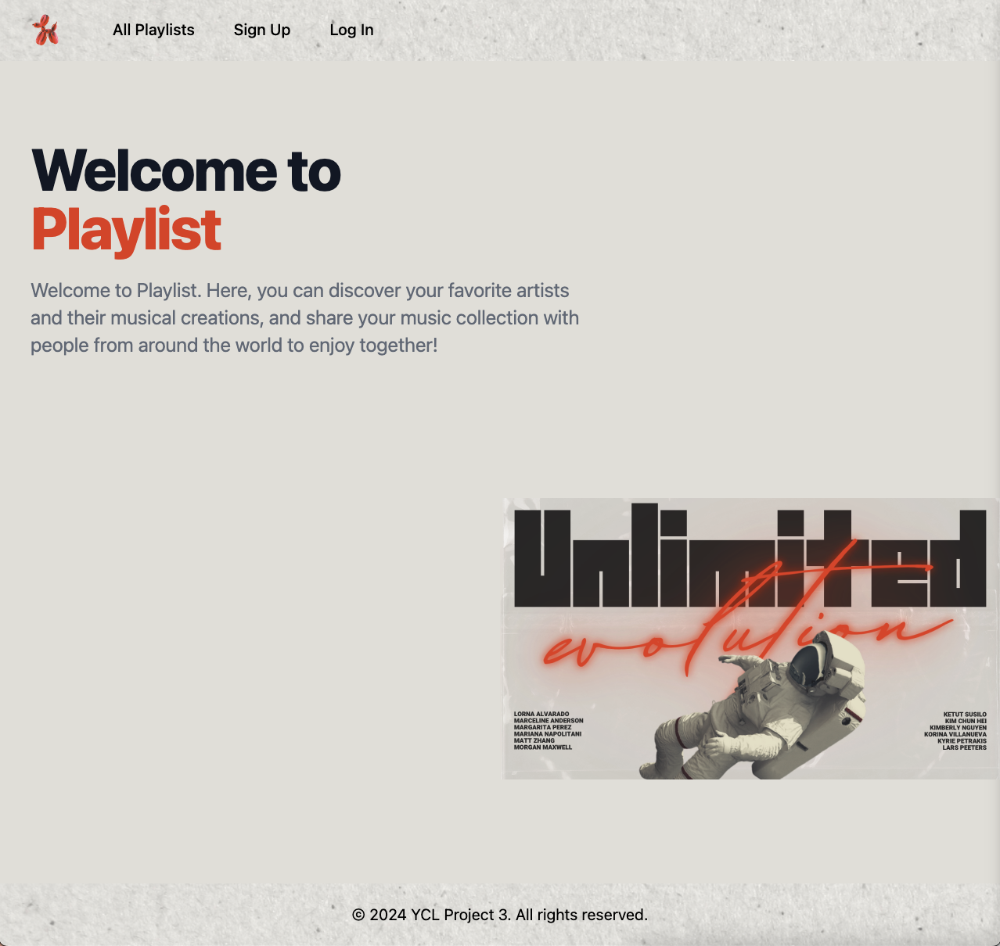
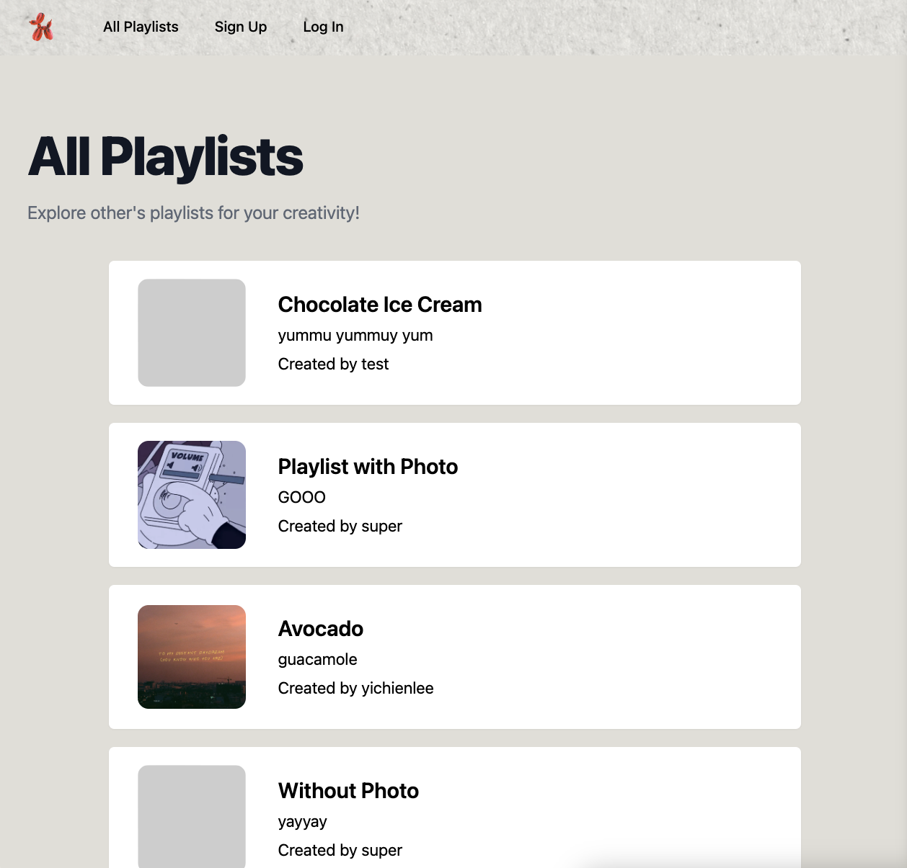
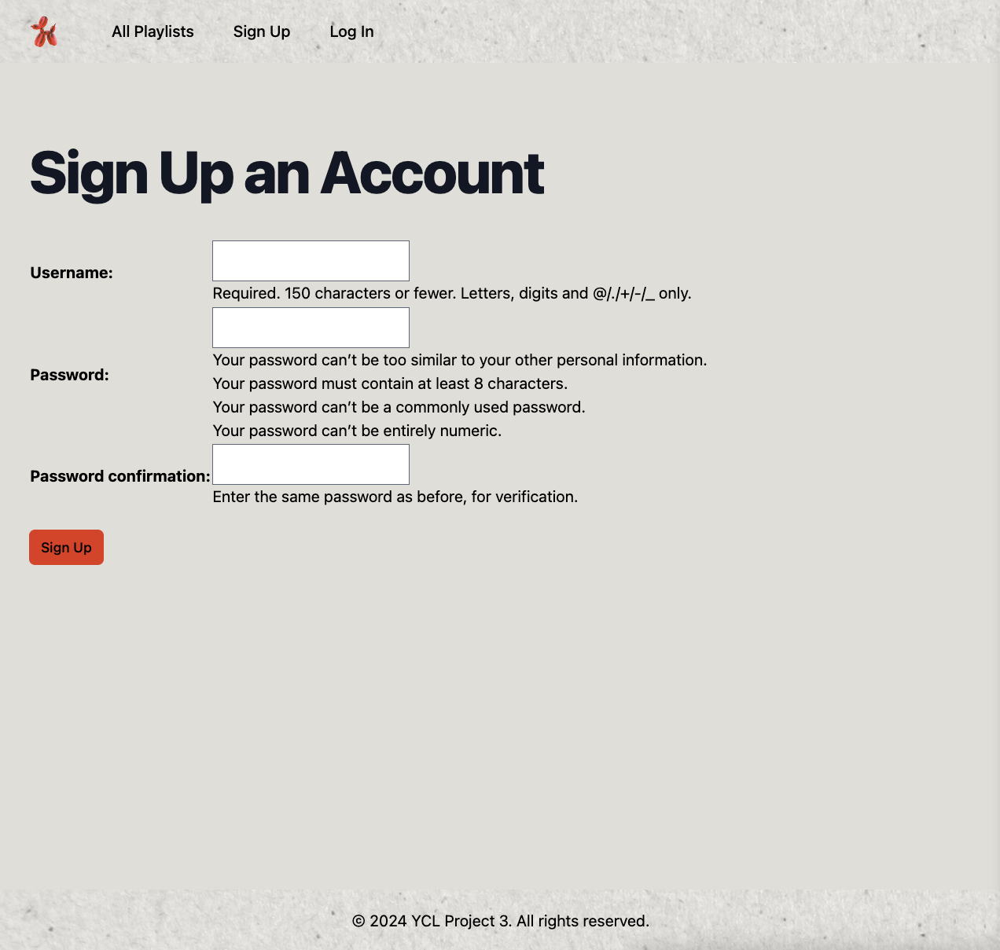
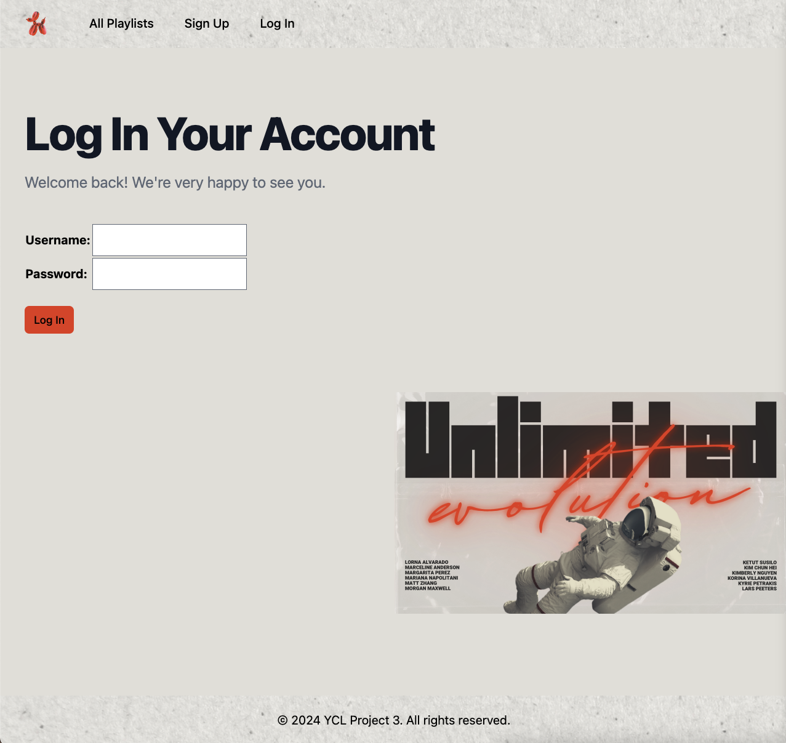
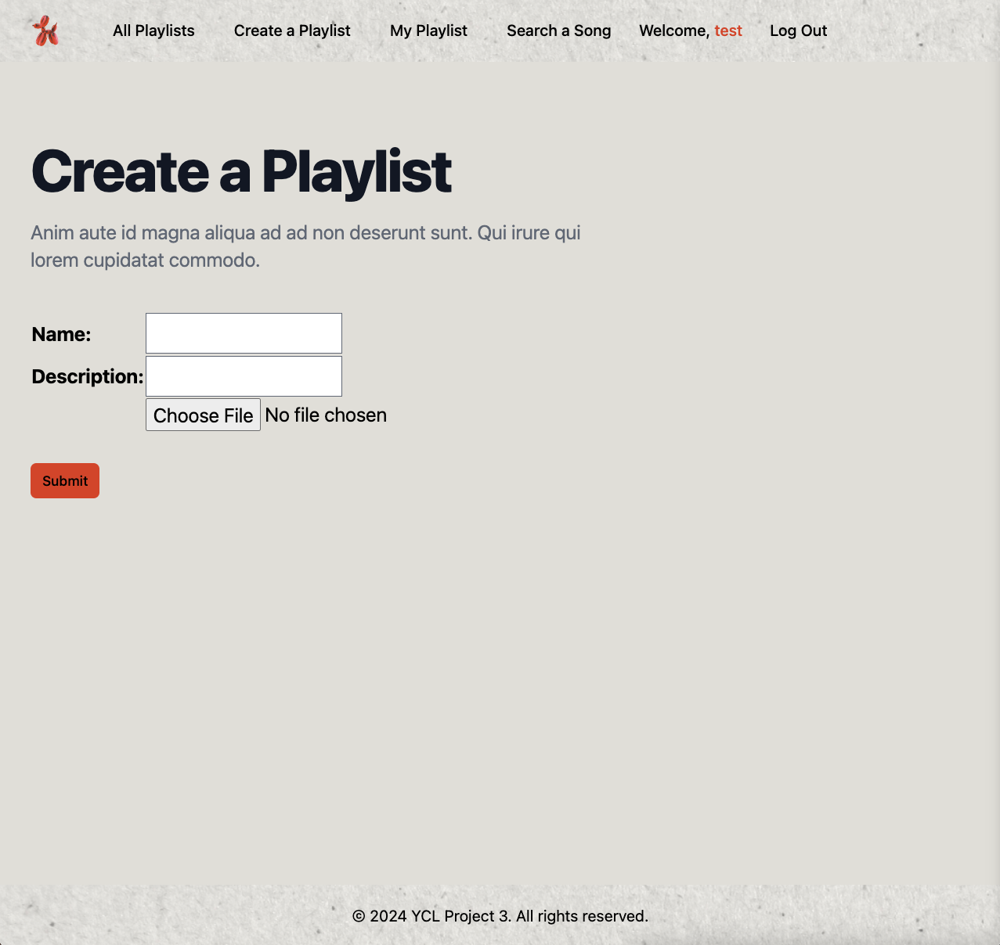
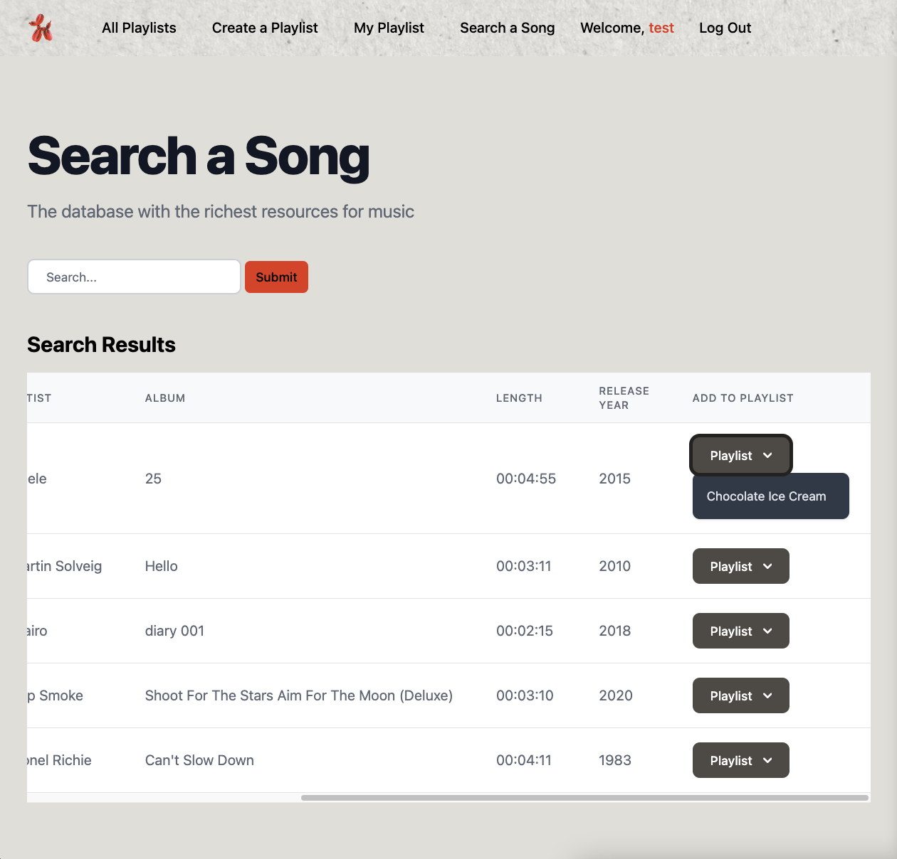
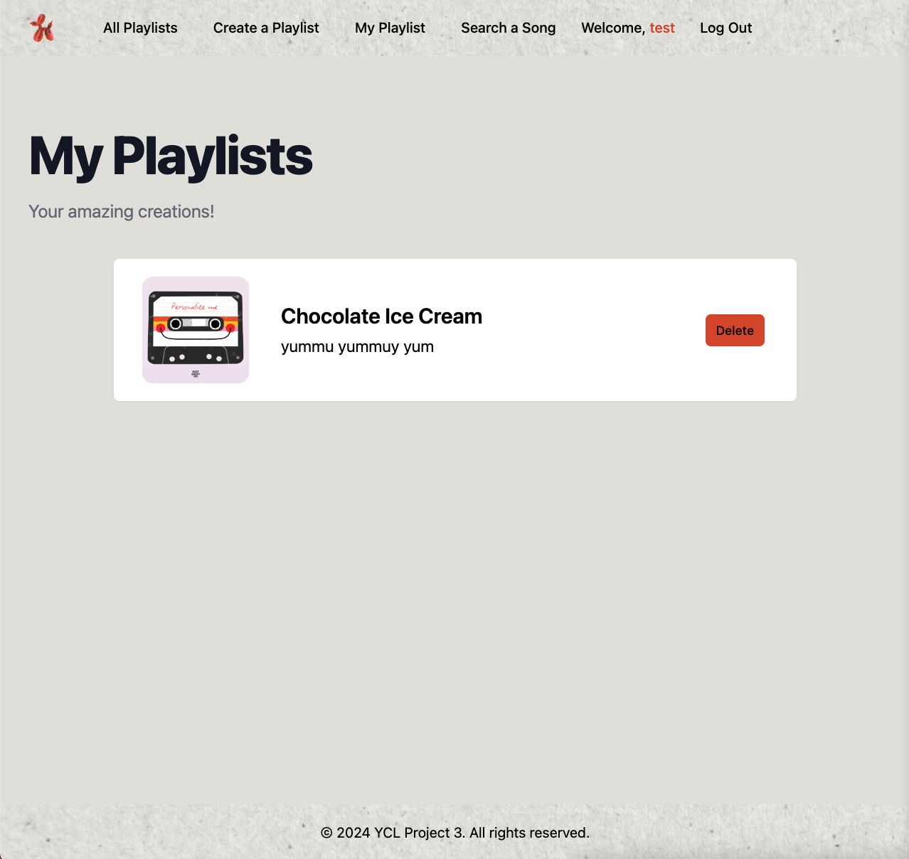
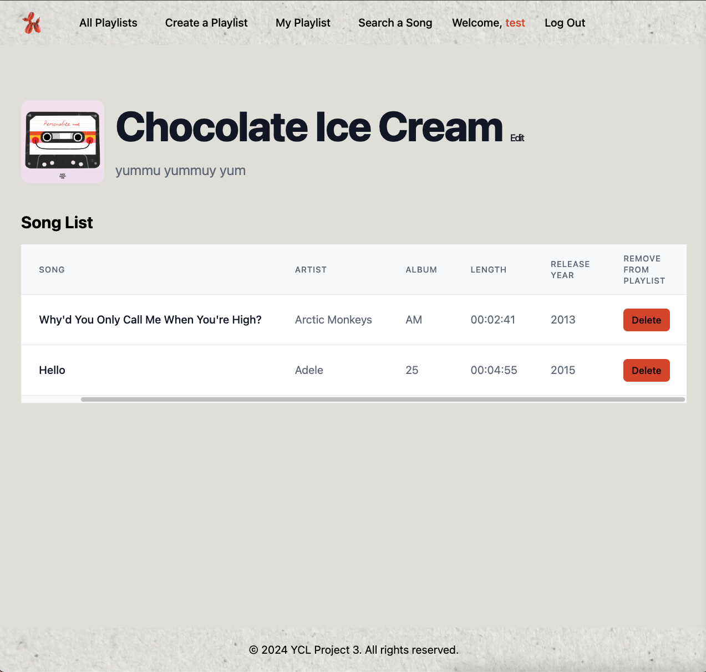

# Playlist Summary
Link for [Playlist](https://playlist-review-b7a11bd17b1b.herokuapp.com/).
Playlist is a web application that enables users to search for music and add their favorite songs to personalized playlists. Users have the ability to create, view, edit, and delete their playlists. Additionally, visitors can explore playlists created by other users.

# Screenshot
## As a Visitor

    
    
    
    

## As a User

    
    
    
    

# Technologies Used
- Python (Django, MVT (Model-View-Template) architecture, Spotify API)
- HTML
- CSS (Tailwind)
- Postgres
- AWS S3
- Heroku

# Project
This project constitutes a full-stack application built on the Django framework, integrating built-in authentication and views for CRUD operations. Utilizing PostgreSQL as the database, it manages entities such as users, songs, and playlists. Furthermore, the application enables users to upload playlist covers to AWS S3. Leveraging the Spotify API, insights and resources from Akamai Developer greatly influenced its implementation, and I extend my gratitude to the content creators for their invaluable contributions to my learning journey. Tailwind CSS was employed for styling, supplemented by various components sourced from online templates, with design inspirations also drawn from Rolsolana Fursa on Canva. The application has been successfully deployed on Heroku.

# Next Steps
Planned future enhancements:
- [ ] add `liked` funcationality for each playlist so that user can collect other's playlists
- [ ] add `filter` and `sort` for playlist index page for different view

Link for my [trello](https://trello.com/b/fdHx8mMk/project-3) of this project. You can also find wireframe and entity relation diagram here.
